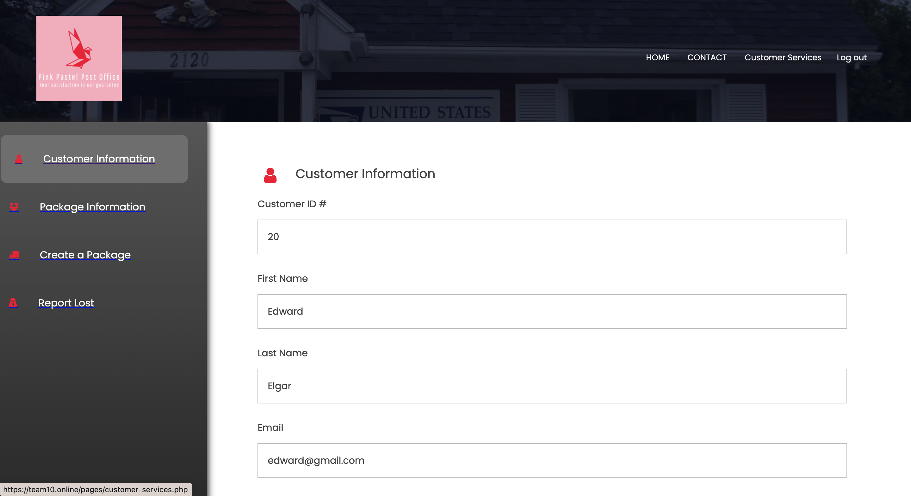

# Pink Pastel Post Office

All members of this repo (Armando, Alexander, Derek, Sevilay, and Zachary) contributed equally to this project.

---

### Table of Contents
- [Description](#description)
- [How To Use](#how-to-use)
- [User Authentication](#user-authentication)
- [Data Entry Forms](#data-entry-forms)
- [Triggers](#triggers)
- [Data Queries](#data-queries)
- [Data Reports](#data-reports)
- [Old Backend Folder](#data-reports)

---

## Description

Our web application was constructed using the following tools and technologies listed below.

#### Tools and Technologies

- HTML
- CSS
- JavaScript
- PHP
- MySQL

[Back To The Top](#pink-pastel-post-office)

---

## How To Use

We recommend you visit our site online, which is hosted at [team10.online](https://team10.online/)

#### Installation
If you wish run this on localhost instead, you will need to install [XAMPP](https://www.apachefriends.org/index.html). Once XAMPP is intalled, you can open it and do the following to get this running:
- Under "General", click "Start" and take note of the IP Address assigned to you.
- Under "Services", click "Start All".
- Under "Network", enable either SSH port option.
- Under "Volumes", click "Mount". This will the IP Address to your Finder (mac) / File Explorer (windows).
- Follow the mounted directory until you see a folder called htdocs. Here you will drop our entire repo.
- Then you can type the IP Address assigned to you into your browser and navigate to the pages folder. For example, 192.168.64.2/COSC3380-PostOffice/root/pages

[Back To The Top](#pink-pastel-post-office)

---

## User Authentication

#### Registration

Once you enter our site, you can click on "REGISTER / SIGN IN" on the top right. You will be prompted to a login screen as shown in the image below. Click on "signup now" and fill out the registration form to create a customer account. For example, I will type in the following information to create an account for a new customer

- First Name: Edward
- Last Name: Elgar
- Email: edward@gmail.com
- Phone Number: 7138853697
- Create a Password: 123
- Confirm a Password: 123
- Building Number: 15
- Street Name: Brentway
- City: Austin
- State: Texas
- Zipcode: 99032

Once you click on "Sign Up" an account will be created for you and you can login. We have also created a test account for you if you'd like to skip registration and login. The login information is
- Email: customer@gmail.com
- Password: 123

Important Notes
- All user passwords are hashed before being stored into the database for privacy reasons. You can see this in our code when a user is created in the functions.inc.php file inside of the includes folder.
- If you do not use the correct login information you will get an error message in red
- When registering for an account, validation is in place to make sure proper characters / numbers are used. If create a password and confirm password do not match, the account will not be created and you will be redirected to fix the information.

Once you are logged in as a customer, you will see a "Customer Services" Link in your navigation bar on the top right. Clicking that will direct you the the customer control panel, which includes all functionality of a customer: viewing / editing their information, viewing package information, creating packages, and reporting packages as lost.

Employee accounts can only be created through an administrator, which we will showcase later, but below are example accounts that you can login to:
- employee@gmail.com
- admin@gmail.com

Both accounts are using the password 123 for simplicity

If you wanted to test sending packages between post offices, you could use 
- tylerjuan@gmail.com for Post Office #2 
- barker@gmail.com for Post Office #3.  
 
If you wish to test with Post Office #4 or more, you must use admin to create a new employee at that location.

[Back To The Top](#pink-pastel-post-office)

---

## Data Entry Forms

#### Customer Edit Info & Employee Edit Info
Logging into Edward's account that I created for this example and visiting the Customer Services control panel, we can click on "Customer Information" to view Edward's saved information. Edward can scroll to the bottom to find an "Edit Info" button. This will allow him to edit any of his customer information (except his unique customer ID assigned to him upon account creation). Any updates will get saved in the database and reflected in the customer's information page.

This same functionality also exists in any Employee account. 

#### Customer & Employee Send Package
A customer may send a package under "Create a Package" by filling out a form detailing the destination address, package type, weight, volume, priority shipping, and which post office to send it to. We use the customer's address that they created when registering for an account as the return address should something go wrong in the delivery process. After filling this out, they're prompted with a thank you message and the unique package ID associated with this package request. This package ID also becomes available under their "Package Information" page, which shows which office the package is in transit to, the time arrived, and a history table. 

Here I'll create a package under Edward's customer account and select it to be dropped off at the Houston branch.

Employees also have the option of creating a package for a customer by filling out a similar form, but we require the customer's email address. Using the customer's email address we look up their return address and necessary information in the backend. 

Important Notes
- If the customer created a package through their profile at home, the package as marked as "in transit" to the office that they selected. All employees can see packages in transit to their office location and can choose from those to mark them as recieved and automatically update the tracking information in the backend.
- If the employee creates the package for the customer in the office, then the package is marked as "in office" and automatically marked as recieved by the office of the employee who created the package. All packages marked as recieved can then be seen in the employees "Send Out" service, which prompts them to fill out some information on where to send the package to next. We also have triggers in place to keep track of the marked status of a package so that we can keep track of how many packages are in an office at any given point in time for later reports. More details about this will be provided down below.

#### Employee Update Inventory

Under the "Update Inventory" section of an employee's control panel, they are able to view the inventory in their office and click an update button that prompts them to a form to select from their inventory and apply a count increase (or decrease if a negative number is inserted). This change is then reflected when they return to "Update Inentory" and we have a trigger running in the back that inserts a notification into the employee's "Notifications" panel letting them know that an item needs to be restocked once it falls below a certain threshold. 

[Back To The Top](#pink-pastel-post-office)

---

## Triggers

#### Trigger Example 1
Our first trigger involves notifications for new employees.  When a new employee is inserted into the employee table, 
a notification is sent to the admin to confirm and inform them of the employee's successful registration.  After reading,
they may mark notifications as read to make them disappear.

CODE

#### Trigger Example 2

Our second trigger sends a notification when the number of items in stock, such as stamps or envelopes, drops below a
certain level.

CODE

#### Other triggers

We have additional triggers:

-A trigger is used to ensure that an employee cannot be set to their own supervisor.

-Multiple triggers(4) are used to make an Tracking entry whenever a package is entered
into the Tracking_Status table.  Additionally, these triggers ensure that the number 
of packages at a post office is incremented or decremented whenever a package enters
or leaves an office respectively.

[Back To The Top](#pink-pastel-post-office)

[Back To The Top](#pink-pastel-post-office)

---

## Data Queries

#### Employee Mark Recieved

As stated earlier, an employee is able to see which packages are in transit to their office under their "Mark Recieved" panel. These are packages that customers created and selected the logged in employee's branch as drop off, or packages that were sent out by a different branch and in transit to our office. They are presented with a table of those in transit to them and can select from those packages to mark as recieved using the drop down menu. As you can see, Edward's package (the example customer we created in the user authentication section) is listed under there because we are currently logged in under digdug@gmail.com, who is an employee assigned to the Houston branch. If you can recall, Edward selected his package to be sent / dropped off to the Houston branch. 

Once a package is marked as recieved, it will then automatically appear in the employee's "Send Out" panel where they can fill out a form to send it to a new location and it will appear as in transit to that particular office. So if we send it out to Austin branch, then any employee assigned to the Austin branch would be able to see this as in transit to them and mark it as recieved once it arrives to them. 

Here I'll mark Edward's package as recieved. 

#### Employee Send Out

Since we marked Edward's package as recieved, it now appears in our "Send Out" panel, which has a list of all packages in our office that have been marked as recieved and are ready to send out.

Here I'll select Edward's package (unique ID 43 as seen in the image), and select to send it out to the Austin Branch. Once this is marked for send out, the Austin branch will be able to see it as in transit to their office. The tracking status will also automatically be updated for Edward under his "Package Information" section. This is all done using queries to our database and PHP in the backend. 

Going back to Edward's package history, we can see the updates.

#### Employee Report Lost 

Instead of marking a package as recieved, the employee can mark any package in transit to them as lost if it has been too long and they have not recieved it. In the backend we have queries to see which packages have been marked as lost and this will automatically let the customer know under their package history that the package has been marked as lost and to call their neareset post office to resolve the issue. 

To see this in action, you could create a package under a cusomer account, send it to an office where you have an employee account to (sending to Houston Branch for example and logging in as digdug@gmail.com with password 123) and the log into Dug's account an mark the package as lost. Or you can keep sending it to another branch and mark it as lost in another branch. When going back to the customer account, the customer will be able to see a message in red stating that the last package it was in transit to has marked it as lost. Again, all of this is handled in th backend using PHP and queries.

#### Customer Report Lost 

Similarly, when an employee marks a package under "Send Out" as out for delivery, the customer can report it as lost or stolen under their "Report Lost" panel if the destination address claims to have never received the package. From the customer page we run queries to collect all packages in transit to a destined address and from those we display them in a drop down menu for selection to the customer as being able to report as stolen. They cannot report a package as lost until it's been out for delivery. If it's lost between transit then an Employee will handle that as we saw above. 

#### Customer Package History

Under "Package information", a customer can see the history of a package. Where it's currently in transit to, the time arrived, and a table of it's movement history. This is all collected and displayed from the backend using queries to pull from tracking tables and find a package associated with this customer.

[Back To The Top](#pink-pastel-post-office)

---

## Data Reports

### Report 1: Tracking and Delivery
Report Displays statistics of package deliveries both current and past within the set time period.  
Permissions: Admin 
Title: "Tracking and Delivery Report from [month start, year start] to [month end, year end]"  
Display:  
- Total packages delivered within the time period (Default 1 month)  
- Total packages currently in circulation.  
- Number of late deliveries (Including those delivered and those currently in circulation)  
- Number of packages reported lost within time period (Default 1 month)  
- Package value total & average.  
- Average delivery time by priority.  

Filters:  
- Time period (In months)  
- Priority level (Optional) 
- Package Type (Optional) 

In addition, underneath this is a single aggregated table of the data used in this table.

### Report 2: Office Report
Purpose: Displays statistics relating to each office branch.   
Permisions: Admin, manager  
Displays:   
- #Total packages currently in office.   
- Total packages processed during time interval   
- % Passthrough (e.g. what percent of packages pass went through this location)   
- Total value brought in by packages over an interval.   
- New customers over time period. (How many customers sent their first package through at this post office)  
- New Employees   
- Number of Current Employees   
- % of total Employees   

Filters:   
- Time period   
- Specific office. (Required for Manager)   

Underneath the result table is every table used in the creation of the data, minus the data that could theoretically result in a breach of security or privacy.

### Report 3: Purchase Report
Displays the spending habits of customers, the uses at a post office, and the amount of new customers  
Permisions: Admin, manager  
Displays:  
- Report the average cost of a package (Can filter by office)  
- Report average customer spending (Can filter by post office)  
- Report total customer spending to the company (can filter by office, ignore results from the shop)  
- Report percentage of customers using this the post office (can filter by post office or be global)  
- Report total number of deliveries sent by customers (can be global or by post office)  
- Report percentage of packages sent starting at this the post office (can filter by post office or be global)  
- Report of new customer's signing up (Can't do as we don't have the capacity to)  
- Reports of the number of customer's who have sent their first package during this time frame (always global) 
 

Filters:  
- Time period 
- Which post office to view (if any, set automatically for managers)  
- Filters out old customers 
- Filters out new customers
 

 
Similar to the previous Report, this also has every table used in the creation of the data, minus the data that could theoretically result in a breach of security or privacy.

[Back To The Top](#pink-pastel-post-office)

## Old Back End File
This file consists of routes and services that connect to the database and it's fully tested on POSTman to be working. Initially we wanted to create our backend in this direction but we changed strategy to use php instead. 

[Back To The Top](#pink-pastel-post-office)

